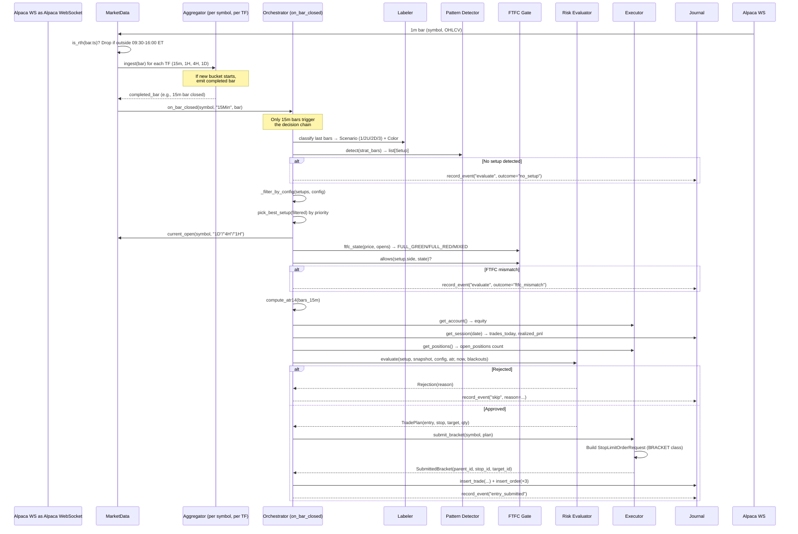
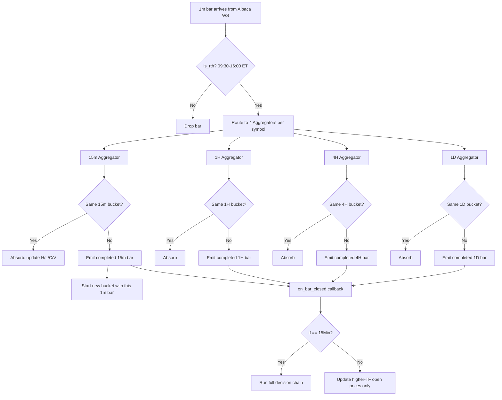
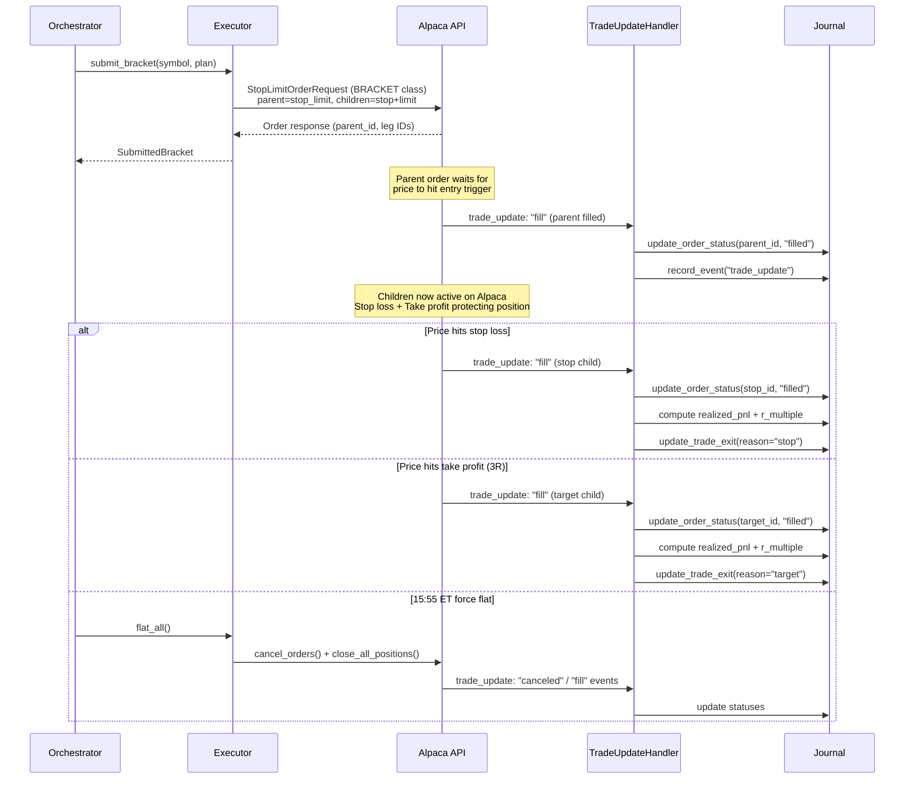
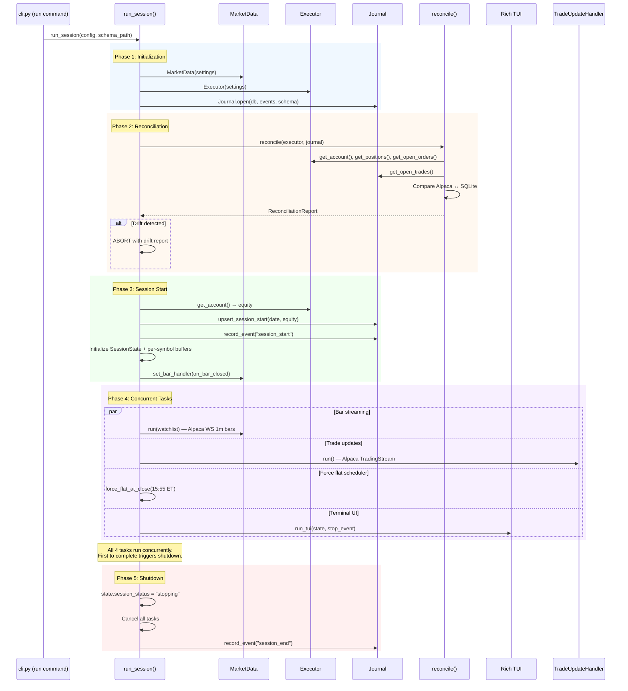
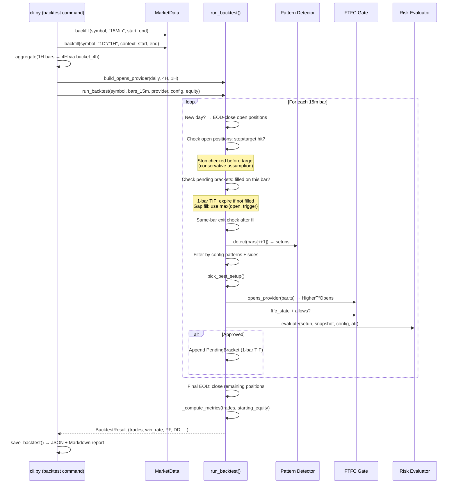
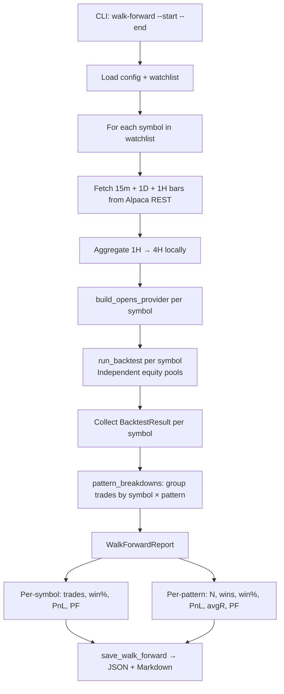
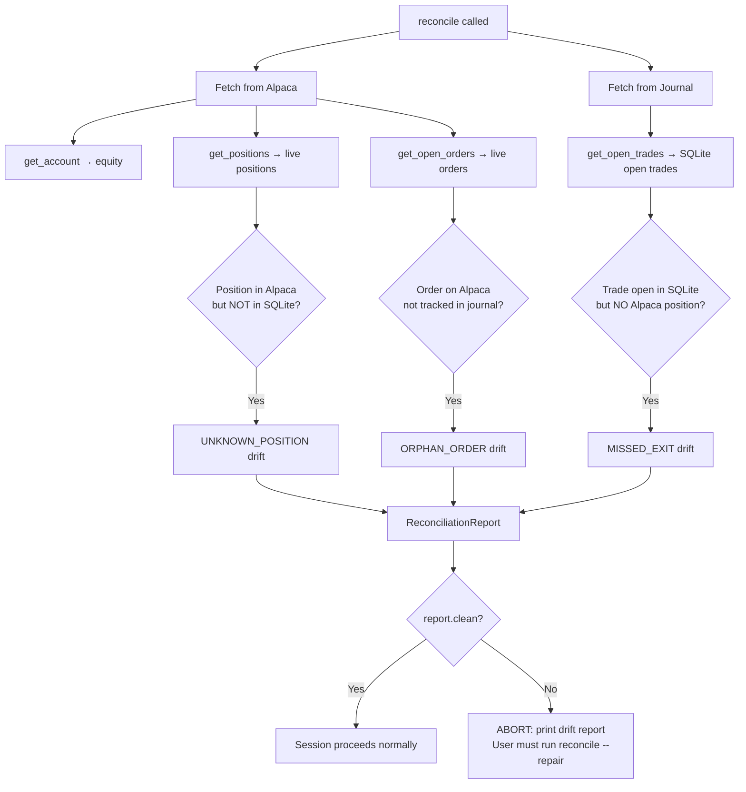
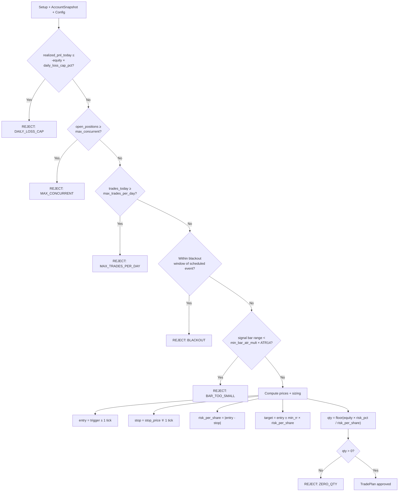

# Architecture & Flow Diagrams

How the system works end-to-end, from bar ingestion through order execution, backtesting, reconciliation, and session lifecycle.

---

## System Architecture

```
┌─────────────────────────────────────────────────────────────┐
│                         CLI (typer)                          │
│  run | backtest | walk-forward | reconcile | status | flat  │
└────┬───────────────┬──────────────┬──────────────┬──────────┘
     │               │              │              │
┌────▼────┐   ┌──────▼─────┐  ┌─────▼─────┐  ┌────▼────────┐
│ Market  │   │  Strategy  │  │   Risk    │  │  Execution  │
│  Data   │──▶│   Engine   │─▶│  Manager  │─▶│   Broker    │
│ (ws+    │   │ (labeler + │  │ (3R, caps,│  │  (Alpaca    │
│  rest)  │   │  patterns) │  │  sizing)  │  │   orders)   │
└─────────┘   └────────────┘  └───────────┘  └─────────────┘
     │                                               │
     └──────────────┬───────────────────────┬────────┘
                    ▼                       ▼
             ┌────────────┐         ┌──────────────┐
             │  Journal   │         │  Trade       │
             │ (SQLite +  │         │  Updates     │
             │  JSONL)    │         │  (WS fills)  │
             └────────────┘         └──────────────┘
```

### Module → File Map

| Module | File | Responsibility |
|--------|------|----------------|
| CLI | `cli.py` | Typer subcommands, wiring |
| Orchestrator | `orchestrator.py` | Session lifecycle, decision chain |
| Market Data | `market_data.py` | Alpaca WS/REST, bar routing |
| Aggregation | `aggregation.py` | 1m → 15m/1H/4H/1D bar rolling |
| Labeler | `strategy/labeler.py` | Classify bars: 1/2U/2D/3 + color |
| Patterns | `strategy/patterns.py` | Detect 3-2-2, 2-2, 3-1-2, rev-strat |
| FTFC | `strategy/ftfc.py` | Full Timeframe Continuity gate |
| Risk | `risk.py` | Position sizing, caps, blackouts |
| Execution | `execution.py` | Alpaca bracket order submission |
| Trade Updates | `trade_updates.py` | WS fill/cancel events → journal |
| Journal | `journal.py` | SQLite trades/orders + JSONL events |
| Reconcile | `reconcile.py` | Alpaca ↔ SQLite drift detection |
| Backtest | `backtest.py` | Historical replay + sim fills |
| Reports | `reports.py` | Save backtest/walk-forward results |
| TUI | `tui.py` | Rich terminal dashboard |
| Config | `config.py` | Pydantic YAML + env settings |

---

## 1. Live Trading Flow

The main flow when a 15m bar closes during a live session.



---

## 2. Bar Aggregation Detail

How 1-minute bars are rolled up into higher timeframes.



Bucket boundaries are anchored to 09:30 ET:
- **15m**: 09:30, 09:45, 10:00, ...
- **1H**: 09:30, 10:30, 11:30, ...
- **4H**: 09:30, 13:30
- **1D**: 09:30 (one bucket per day)

---

## 3. Strategy Decision Chain

The full evaluation pipeline from bar window to trade/skip.

```mermaid
flowchart TD
    A[15m bar window, last 50 bars] --> B{len >= 15?}
    B -- No --> Z1[NOT_ENOUGH_BARS]
    B -- Yes --> C[Convert to strategy Bars]
    
    C --> D[detect: run all 4 pattern detectors]
    D --> D1[detect_three_two_two]
    D --> D2[detect_three_one_two]
    D --> D3[detect_rev_strat]
    D --> D4[detect_two_two]
    
    D1 --> E[Collect all matches]
    D2 --> E
    D3 --> E
    D4 --> E
    
    E --> F{Any matches?}
    F -- No --> Z2[NO_SETUP]
    F -- Yes --> G[Filter by config: allowed patterns + sides]
    
    G --> H{Any surviving?}
    H -- No --> Z3[PATTERN_FILTERED]
    H -- Yes --> I[pick_best_setup by priority]
    
    Note over I: Priority: 3-1-2 > 3-2-2 > rev-strat > 2-2

    I --> J[Get higher-TF opens from aggregators]
    J --> K{Opens available?}
    K -- No --> Z4[FTFC_MISSING]
    K -- Yes --> L[ftfc_state: price vs 1D/4H/1H opens]
    
    L --> M{allows side + state?}
    M -- No --> Z5[FTFC_MISMATCH]
    M -- Yes --> N[Compute ATR14 + build AccountSnapshot]
    
    N --> O[risk.evaluate]
    O --> O1{Daily loss cap hit?}
    O1 -- Yes --> Z6[DAILY_LOSS_CAP]
    O1 -- No --> O2{Max concurrent?}
    O2 -- Yes --> Z7[MAX_CONCURRENT]
    O2 -- No --> O3{Max trades/day?}
    O3 -- Yes --> Z8[MAX_TRADES_PER_DAY]
    O3 -- No --> O4{In blackout?}
    O4 -- Yes --> Z9[BLACKOUT]
    O4 -- No --> O5{Bar range < ATR threshold?}
    O5 -- Yes --> Z10[BAR_TOO_SMALL]
    O5 -- No --> O6[Compute entry/stop/target + position size]
    O6 --> O7{qty > 0?}
    O7 -- No --> Z11[ZERO_QTY]
    O7 -- Yes --> P[Return TradePlan]
    
    P --> Q[Submit bracket order to Alpaca]
    Q --> R[Persist to Journal]
```

---

## 4. Order Lifecycle

From bracket submission through fill/exit on Alpaca.



---

## 5. Session Lifecycle (`run_session`)

The startup, main loop, and shutdown sequence.



---

## 6. Backtest Flow

Historical replay through the same strategy + risk logic, with simulated fills.



### Backtest Fill Simulation Rules

| Rule | Behavior |
|------|----------|
| Entry fill | Parent stop-limit checked against next bar only (1-bar TIF) |
| Gap handling | Long gap-up: fill at `max(bar.open, trigger)` |
| Exit priority | Stop loss checked before target on same bar |
| Same-bar exit | After fill, immediately check if stop/target hit in same bar |
| EOD close | Open positions closed at last bar's close, reason="eod" |
| Equity tracking | Running equity updated after each closed trade |

---

## 7. Walk-Forward Flow

Multi-symbol backtest with per-pattern breakdowns.



---

## 8. Reconciliation Flow

Startup safety check comparing Alpaca live state against the SQLite journal.



### Drift Types

| Kind | Meaning | Typical Cause |
|------|---------|---------------|
| `UNKNOWN_POSITION` | Alpaca has a position not in SQLite | Manual trade outside bot, or bot crashed before journaling |
| `MISSED_EXIT` | SQLite shows open trade, Alpaca has no position | Fill happened while bot was offline |
| `ORPHAN_ORDER` | Alpaca has an open order not tracked in journal | Stale bracket from a previous session |

---

## 9. Pattern Detection Detail

How the labeler and pattern detectors classify the bar window.

```mermaid
flowchart LR
    subgraph Labeler
        direction TB
        B1[Bar t-1] --> CL[classify prev, curr]
        B2[Bar t] --> CL
        CL --> S{Scenario}
        S --> S1[1: Inside<br/>H≤prevH AND L≥prevL]
        S --> S2[2U: Up<br/>breaks high only]
        S --> S3[2D: Down<br/>breaks low only]
        S --> S4[3: Outside<br/>breaks both]
    end

    subgraph Patterns
        direction TB
        P1["3-2-2 Bullish<br/>red 3 → red 2D → green 2U"]
        P2["3-2-2 Bearish<br/>green 3 → green 2U → red 2D"]
        P3["3-1-2 Bullish<br/>3 → 1 → green 2U"]
        P4["3-1-2 Bearish<br/>3 → 1 → red 2D"]
        P5["Rev Strat Bull<br/>1 → red 2D → green 2U"]
        P6["Rev Strat Bear<br/>1 → green 2U → red 2D"]
        P7["2-2 Bullish<br/>red 2D → green 2U"]
        P8["2-2 Bearish<br/>green 2U → red 2D"]
    end

    subgraph FTFC Gate
        direction TB
        F1[Price > 1D open AND<br/>Price > 4H open AND<br/>Price > 1H open] --> FG[FULL_GREEN → allow LONG]
        F2[Price < 1D open AND<br/>Price < 4H open AND<br/>Price < 1H open] --> FR[FULL_RED → allow SHORT]
        F3[Anything else] --> FM[MIXED → block all]
    end

    Labeler --> Patterns
    Patterns --> FTFC Gate
```

---

## 10. Risk Evaluation Pipeline

Sequential gate checks applied to every approved setup.



Default risk parameters: 0.5% risk/trade, 2% daily loss cap, 3 max concurrent, 5 max trades/day, 3R minimum target.
